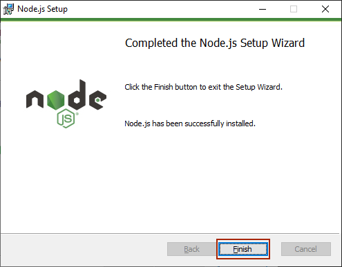

# Webpack

---

## webpack là gì?

Webpack nôm na là một gói module cho các ứng dụng Javascript.

Một vài ứng dụng phổ biến của Webpack mà bạn sẽ thích:

- Đóng gói nhiều file Javascript, CSS thành một file duy nhất, điểm đặc biệt là Webpack sẽ tổ chức các nội dung trong các file Javascript một

- cách khoa học hợp lý, chẳng hạn như gom các function giống nhau thành một function chung duy nhất.

- Gói gọn các file Javascript và Css thành dạng minify (nội dung file là 1 hàng duy nhất, loại bỏ các khoảng trống thừa, giúp file nhỏ gọn nhất).

- Thực thi các file SCSS một cách tự động, nếu bạn nào làm việc nhiều với SCSS thì chắc chắn sẽ thích tính năng này.

- Tối ưu hóa image, SVG, nén các file với dung lượng nhỏ nhất, hoặc chuyển đổi file thành URL (Base64) và chèn URL này vào Bundle.

- Giúp thao tác local, development hay server một cách thuận lợi, như tự động loading (build) khi save, hay kiếm soát quá trình upload file

- tránh sai sót, ...

- Cài đặt hàng loạt ứng dụng một cách đơn giản: SCSS, ReactJS, ...

- Hàng loạt tính năng khác chờ bạn khám phá: biên dịch Babel ES6 sang ES5, biên dịch CoffeeScript sang Javascript, tách nhỏ thành nhiều file, ...

- Và quan trọng là Webpack hoàn toàn miễn phí.

  Đối tượng học Webpack: không chỉ các bạn lập trình viên Front-end mà cả các bạn Back-end cũng cần phải biết.


Với hàng loạt tính năng hữu ích như trên, việc nắm vững Webpack chắc chắn sẽ giúp bạn nhiều trong công việc, bắt đầu học Webpack thôi ^^

---

## Cài đặt Webpack

Bài học này sẽ giúp bạn cài đặt được Webpack, các bước tiến hành.

- Cài đặt môi trường Node.js

- Cài đặt Webpack

---

### Cài đặt môi trường Node.js

---

#### Node.js là gì?

Để cài đặt Webpack, bạn cần phải cài đặt môi trường Node.js trước.

- Node.js là một nền tảng phát triển ứng dụng Javascript, nó cung cấp cho bạn một môi trường để chạy Javascript trên máy tính, giúp bạn có thể chạy Javascript mà không cần trình duyệt.

- Ứng dụng của Node.js rất nhiều: dùng thực thi Webpack, SASS, ..., hay viết các ứng dụng: Websocket server, fast File Upload Client, Cloud Services, RESTful API, ...

- Node.js cũng cung cấp cho bạn một công cụ quản lý các gói module, giúp bạn có thể cài đặt Webpack một cách dễ dàng.

- Node.Js Có thể chạy ứng dụng Nodejs ở bất kỳ đâu trên máy Mac, Window, Linux,...


---

#### Cài đặt Node.js

Để cài đặt Node.js, bạn vào trang chủ của Node.js tại địa chỉ [https://nodejs.org](https://nodejs.org) và tải bản cài đặt phù hợp với hệ điều hành của bạn.


---


> Bước này nếu bạn đã cài đặt C/C++ thì không click vô checkbox **`Automatic ...`** nhé, còn nếu chưa thì click cài cũng được vì C/C++ cần cho Node.js chạy, chú ý là click cài thì nó cài một lúc nhiều ứng dụng khác như Python, Visual Studio Build Tools @@, mấy cái này ai cần thì cài thôi nhé.


---


---



Click **`Finish`** để hoàn tất cài đặt.

Kiểm tra cài đặt bằng cách mở "cmd" (nhấn tổ hợp phím **`Window + R`**, gõ **`cmd`**, enter).


---


---

Gõ lần lược **`node -v`** và **`npm -v`** để xem phiên bản cài đặt, nếu kết quả trả về là 2 phiên bản là cài đặt thành công.

```shell
node -v

npm -v
```


---

### Cài đặt Webpack

Sau khi đã cài đặt xong Node.js rồi, thì các bạn có thể tiếp theo các bước bên dưới nhé.

Webpack làm việc chủ yếu thông qua lệnh **`npm`**.

**`npm`** (Node Package Manager) là một công cụ quản lý các thư viện Javascript cho Node.js, hầu như được sử dụng rất nhiều cho các dạng mã nguồn mở.

Bắt đầu cài đặt Webpack bằng các lệnh sau:

- Trước tiên ta cần tạo thư mục làm việc tại bất kỳ nơi đâu trên Window, ví dụ tạo thư mục **`Webpack-project`** tại ổ đĩa D:/.


---

- Mở "cmd" (nhấn tổ hợp phím **`Window + R`**, gõ **`cmd`**, enter).

- Từ cửa sổ **`cmd`** (nhấn tổ hợp phím **`Window+R`**, gõ **`cmd`**, enter) ta trỏ tới ổ đĩa **`D:/`** bằng lệnh:

```shell
D:
```


- Trỏ tới thư mục chứa **`Webpack-project`** bằng lệnh:

```shell
cd Webpack-project
```

---


- Tiến hành cài Webpack lần lược với các dòng lệnh sau:

```shell
npm init -y
```

---


Dòng lệnh trên sẽ khởi tạo nội dung đầu tiên cho Webpack, khi nào xem bên trong thư mục **`Webpack-project`** sẽ thấy file **`package.json`** được tạo, có nội dung sau:

```json
{
  "name": "Webpack-project",
  "version": "1.0.0",
  "description": "",
  "main": "index.js",
  "dependencies": {
    "webpack-cli": "^3.3.9",
    "webpack": "^4.40.2"
  },
  "devDependencies": {},
  "scripts": {
    "test": "echo \"Error: no test specified\" && exit 1"
  },
  "keywords": [],
  "author": "",
  "license": "ISC"
}
```

> Tạm thời chưa cần quan tâm tới nội dung này nhé.

Tiếp theo ta cài đặt Webpack bằng lệnh:

```shell
npm install --save-dev webpack
```

**Kết quả** (Báo gì kệ nó, chưa cần quan tâm ^^):

---


Khi này trong thư mục **`Webpack-project`** đã được tự động tạo thư mục và file, trong đó **`node_modules`** chứa tất cả modules liên quan, sau này cài đặt module nào thì sẽ được lưu ở đây.

- Tiếp tục cài đặt **`webpack-cli`** với dòng lệnh sau:

```shell
npm install --save-dev webpack-cli
```

---

**Kết quả:**


- Vậy là cài xong Webpack rồi đó ^^, nội dung trên thấy dài vậy thôi, chứ cài Node.js xông, trỏ tới thư mục project, chạy có mấy dòng lệnh chính à :"D

- Cài đặt Webpack không phức tạp lắm đúng không ^^, chúng ta tiếp tục với nội dung đầu tiên của Webpack thôi.

---

#### Các lệnh chính đã sử dụng trong toàn bộ bài học

| Lệnh                                     | Ý nghĩa                                |
| ---------------------------------------- | -------------------------------------- |
| **`cd Webpack-project`**                 | Trỏ tới thư mục chứa project           |
| **`npm init -y`**                        | Khởi tạo nội dung đầu tiên cho Webpack |
| **`npm install --save-dev webpack`**     | Cài đặt Webpack                        |
| **`npm install --save-dev webpack-cli`** | Cài đặt Webpack CLI                    |

---

## Webpack Bundle

---

### Webpack Bundle là gì?

- Webpack Bundle là một file Javascript duy nhất, chứa toàn bộ nội dung của các file Javascript khác.

- Webpack Bundle được tạo ra bởi Webpack, nó sẽ tự động tạo ra một file Bundle duy nhất, chứa toàn bộ nội dung của các file Javascript khác.

- Webpack Bundle có thể được tạo ra từ nhiều file Javascript, CSS, SCSS, hay các file khác.

- Webpack Bundle có thể được tạo ra từ nhiều thư mục khác nhau, thậm chí là từ các thư mục ở xa, trên mạng.

---

### Webpack - Hello world

- Sau khi cài đặt Webpack, chúng ta đã tạo được cấu trúc thư mục bên trong **`Webpack-project`** như sau:


---

#### Chuẩn bị

- Bây giờ ta lần lượt tạo các file theo cấu trúc như bên dưới:


---

##### Nội dung **index.html**

```html
<!DOCTYPE html>
<html>
  <head>
    <title>Webpack</title>
  </head>
  <body>
    <script src="./src/index.js"></script>
  </body>
</html>
```

---

##### Nội dung **/src/index.js**

```javascript
function component() {
  const element = document.createElement("div");
  element.innerHTML = "Hello World!";
  return element;
}
document.body.appendChild(component());
```

Nội dung **`/src/index.js`**: tạo thẻ **`<div>`**, chèn nội dung **`'Hello World!'`**, cho xuất hiện ở trang HTML. Khi này click chạy file **`index.html`**, ta sẽ có kết quả sau:

---

##### Kết quả chạy file **`index.html`**

```shell

Hello World!

```

---

#### Tạo Webpack Bundle

- Nói nôm na là ta tạo một đóng gói cho project, gom nội dung javascript vào chung một file duy nhất, và minify nó lại.

- Ta tiến hành điều chỉnh cấu trúc thư mục như bên dưới:

  - Tạo thư mục **`dist`** bên trong thư mục **`Webpack-project`**.

  - Di chuyển file **`index.html`** vào thư mục **`dist`**.


---

- Cấu trúc trên giúp phân biệt rõ:

  - Thư mục **`src`** sẽ chứa nội dung dành cho input, tức là tất cả file Javascript (hoặc các file như css, scss, ...) bên trong sẽ do bạn tạo và viết code.

  - Thư mục **`dist`** sẽ chứa nội dung dành cho output, các file javascript (hoặc các file như css, js, ...) sẽ do Webpack tự động tạo.

- Thay đổi nội dung file `/dist/index.html` như sau:

**Nội dung index.html**

```html
<!DOCTYPE html>
<html>
  <head>
    <title>Webpack</title>
  </head>
  <body>
    <script src="main.js"></script>
  </body>
</html>
```

- Ta sẽ dùng Webpack tự động tạo file **`main.js`** từ file **`./src/index.js`** với nội dung được minify bên trong.

- Mở **`cmd`**, trỏ tới thư mục **`Webpack-project`**, chạy lệnh:

```shell
npx webpack
```

**Kết quả:**


- Ta thấy khi này trong cấu trúc thư mục đã được Webpack tự động tạo file **`main.js`** với nội dung minify và được lưu bên trong thư mục **`dist`**.

---


**Nội dung file /dist/main.js**

```js
document.body.appendChild(
  (function () {
    const e = document.createElement("div");
    return (e.innerHTML = "Hello World!"), e;
  })()
);
```

Tất nhiên khi này click chạy trang **`/dist/index.html`** vẫn sẽ cho ta kết quả tương tự:

```shell
Hello World!
```

---

- Tới đây có lẽ bạn đã hình dung được cách hoạt động của Bundle là như thế nào rồi he ^^.

- Bài học sau sẽ giúp bạn cách tạo và cấu hình cho Webpack.

#### Các lệnh chính đã sử dụng trong toàn bộ bài học

| Bài học         | Lệnh đã dùng                                                                                                                     |
| --------------- | -------------------------------------------------------------------------------------------------------------------------------- |
| Cài đặt Webpack | **`npm init -y`** <br> **`npm init -y`** <br> **`npm install --save-dev webpack`** <br> **`npm install --save-dev webpack-cli`** |
| Webpack bundle  | **`npx webpack`**                                                                                                                |

---

## Cấu hình Webpack

- Việc cấu hình Webpack giúp chúng ta thuận tiện hơn cho sau này, ví dụ như điều khiển input, output, điều khiển các loader, hay thêm các module một cách đơn giản hơn, ...

- Ta bắt đầu cấu hình Webpack bằng cách tạo file **`webpack.config.js`** như bên dưới:


---

**Nội dung file /webpack.config.js**

```js
const path = require("path");

module.exports = {
  entry: "./src/index.js",
  output: {
    filename: "main.js",
    path: path.resolve(__dirname, "dist"),
  },
};
```

- **`entry: './src/index.js'`** đây là file input (do chúng ta tạo và code nội dung).

- **`output`** ta thấy chia làm 2 phần:

  - **`filename: 'main.js'`** đây là file output (code được Webpack tự động sinh ra).

  - **`path: path.resolve(__dirname, 'dist')`** đường dẫn chứa file output, chúng ta hoàn toàn có thể thay đổi đường dẫn này, ví dụ như thay vì **`dist`**, ta có thể dùng **`public/js/`**.

- Chạy lệnh sau để thực thi file cấu hình vừa tạo:

```shell
npx webpack --config webpack.config.js
```

**Kết quả:**


---

- Thay vì mỗi lần cần thực thi nội dung Webpack bằng cách chạy lệnh từ **`npx`** thì ta sẽ chạy từ **`npm`** (đây là cách tiện lợi hơn, thường được dùng hơn).

- Ta tiến hành thay đổi file **`package.json`** như sau:

```json
{
  "name": "Webpack-project",
  "version": "1.0.0",
  "description": "",
  "main": "index.js",
  "dependencies": {
    "webpack-cli": "^3.3.9",
    "webpack": "^4.40.2"
  },
  "devDependencies": {},
  "scripts": {
    "test": "echo \"Error: no test specified\" && exit 1",
    "build": "webpack"
  },
  "keywords": [],
  "author": "",
  "license": "ISC"
}
```

- Chú ý có dấu phẩy.

- Từ giờ, chúng ta có thể chạy lệnh **`npm run build`** thay thế cho lệnh từ **`npx`**

```shell
npm run build
```

**Kết quả:**


---

- Tạm thời ta biết cách cấu hình Webpack như thế nào rồi he.

- Bài học sau sẽ giúp bạn cách cấu hình file **`webpack.config.js`** để quản lý các file đầu ra (output).

#### Các lệnh chính đã sử dụng trong toàn bộ bài học

| Bài học          | Lệnh đã dùng                                                                                                         |
| ---------------- | -------------------------------------------------------------------------------------------------------------------- |
| Cài đặt Webpack  | **`npm init -y`** <br> **`npm init -y`** <br> **`npm i --save-dev webpack`** <br> **`npm i --save-dev webpack-cli`** |
| Webpack bundle   | **`npx webpack`**                                                                                                    |
| Cấu hình Webpack | **`npx webpack --config webpack.config.js`** <br> **`npm run build`**                                                |

---

## Webpack quản lý đầu ra (output)

- Bài học sau đây sẽ hướng dẫn các bạn cách quản lý đầu ra các file như javascript (css, scss, ... sẽ hướng dẫn ở các bài liên quan khác).

- Từ cấu trúc ban đầu, ta tạo thêm file **`my-test.js`** bên trong thư mục **`src`**:


**Nội dung file `/src/my-test.js`**

```js
function component() {
  const element = document.createElement("p");
  element.innerHTML = "This content called from my-test.js!";
  return element;
}
document.body.appendChild(component());
```

- Nội dung file trên sẽ gọi thẻ **`<p>`** bên trong file html với nội dung **`This content called from my-test.js!`**

- Tuy nhiên do chưa kết nối file này vào file **`/src/index.js`**, nên chưa thực thi được.

---

### Cấu hình tự động tạo các file Javascript tương ứng

- Trước khi gộp (merge) file, ta thử tạo các file output tương ứng, bằng cách cấu hình file **`webpack.config.js`** như sau:

**Nội dung file `webpack.config.js`:**

```js
const path = require("path");

module.exports = {
  entry: {
    /*[name]: [path]*/
    app: "./src/index.js",
    print: "./src/my-test.js",
  },
  output: {
    filename: "[name].bundle.js",
    path: path.resolve(__dirname, "dist"),
  },
};
```

- Nội dung trên cho biết, với 2 file đầu vào là **`./src/index.js`** và **`./src/my-test.js`** sẽ được output ra các file với tên tương ứng lấy từ **`entry`** (là **`app`** và **`print`**), lấy 2 tên này đổ vào **`[name].bundle.js`**, và các file **`.bundle.js`** này sẽ được chứa trong thư mục **`dist`**.

- Tiến hành chạy lệnh **`npm`** để thực thi nội dung trên:

```shell
npm run build
```

**Kết quả:**


---

- Cấu trúc thư mục lúc này:


- Nhìn vào cấu trúc trên, ta thấy Webpack đã tự động tạo 2 file là **`/dist/app.bundle.js`** và **`/dist/print.bundle.js`** với nội dung đã được minify.

- Muốn chạy được nội dung 2 file này, ta cần khai báo 2 **`script`** bên trong trang **`/dist/index.html`**

**Nội dung file `/dist/index.html`**

```html
<!DOCTYPE html>
<html>
  <head>
    <title>Webpack</title>
  </head>
  <body>
    <script src="app.bundle.js"></script>
    <script src="print.bundle.js"></script>
  </body>
</html>
```

- Khi này click chạy file **`/dist/index.html`** ta sẽ thấy kết quả sau:

**Hiển thị trình duyệt**

```shell
Hello World!
This content called from my-test.js!
```

- Tới đây thì file **`/dist/main.js`** đã không còn cần nữa, tuy nhiên đừng xóa nhe, ta sẽ dọn dẹp nó sau.

- Bài học sau sẽ giúp bạn cách quản lý nội dung file HTML hiệu quả.

#### Các lệnh chính đã sử dụng trong toàn bộ bài học

| Bài học          | Lệnh đã dùng                                                                                                         |
| ---------------- | -------------------------------------------------------------------------------------------------------------------- |
| Cài đặt Webpack  | **`npm init -y`** <br> **`npm init -y`** <br> **`npm i --save-dev webpack`** <br> **`npm i --save-dev webpack-cli`** |
| Webpack bundle   | **`npx webpack`**                                                                                                    |
| Cấu hình Webpack | **`npx webpack --config webpack.config.js`** <br> **`npm run build`**                                                |
| Webpack output   | **`npm run build`**                                                                                                  |
