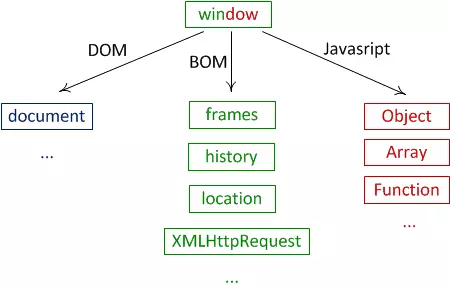

<!-- Tổng quan về BOM trong Javascript -->

## Tổng quan về BOM



BOM là chữ viết tắt của Browser Object Model, hay còn gọi là các đối tượng liên quan đến trình duyệt browser. Mỗi browser sẽ có những đối tượng khác nhau nên nó không có một chuẩn chung nào cả. Tuy nhiên, để có tính thống nhất giữa các trình duyệt thì người ta quy ước ra các loại BOM sau:

1. **window**: Đối tượng window đại diện cho cửa sổ trình duyệt và là đối tượng chứa tất cả các đối tượng khác. Ví dụ, chúng ta có thể sử dụng nó để hiển thị thông báo cho người dùng:

```javascript
window.alert('Xin chào!');
```

2. **screen**: Đối tượng screen chứa thông tin về màn hình người dùng. Ví dụ, chúng ta có thể lấy chiều rộng và chiều cao của màn hình:

```javascript
var w = window.screen.width;
var h = window.screen.height;
```

3. **location**: Đối tượng location chứa thông tin về URL hiện tại và cho phép chúng ta chuyển hướng đến URL khác. Ví dụ, chúng ta có thể sử dụng nó để chuyển hướng đến một trang web khác:

```javascript
window.location.href = 'https://fullstack.edu.vn.com';
```

4. **history**: Đối tượng history cho phép chúng ta điều hướng qua lịch sử trình duyệt. Ví dụ, chúng ta có thể sử dụng nó để điều hướng trở lại trang trước đó:

```javascript
window.history.back();
```

5. **navigator**: Đối tượng navigator chứa thông tin về trình duyệt. Ví dụ, chúng ta có thể lấy tên trình duyệt:

```javascript
var n = window.navigator.appName;
```

6. **cookies**: Cookies cho phép chúng ta lưu trữ dữ liệu người dùng trên trình duyệt. Ví dụ, chúng ta có thể tạo một cookie như sau:

```javascript
document.cookie = 'username=email@fullstack.edu.vn';
```

## Kết luận

Trong các đối tượng BOM trên có phân cấp lẫn nhau và trong đó window là cấp cao nhất vì nó đại diện cho browser. Ví dụ khi chúng ta muốn truy cập tới document thì chúng ta sẽ viết là window.document, tuy nhiên vẫn có cách ghi tắt là document, muốn truy cập tới cookie thì ta viết window.document.cookie (viết tắt document.cookie), ...

---

<!-- Lấy kích thước trình duyệt -->

## Window trong javascript.

Trong javascript, window là một đối tượng thuộc nhóm BOM - tức là một object có những phương thức và thuộc tính được dùng để xử lý trình duyệt.

Công dụng của window chủ yếu là các thao tác với trình duyệt như: Tính chiều cao - di chuyển - thay đổi kích thước - mở ra một tab mới - lấy đường dẫn url của website. Vì vậy, nếu chúng ta đang xây dựng giao diện responsive thì sẽ cần sử dụng đến đối tượng này.

## Window.innerHeight - lấy kích thước trình duyệt.

Để lấy kích thước chiều cao và chiều rộng của trình duyệt thì chúng ta sử dụng đối tượng window, tuy nhiên với mỗi trình duyệt thì có những cách lấy khác nhau.

**Đối với Internet Explorer, Chrome, Firefox, Opera, và Safari thì cú pháp như sau:**

```js
// lấy chiều cao
const heightBrowser = window.innerHeight;

// lấy chiều rộng
const widthBrowser = window.innerWidth;
```

**Đối với Internet Explorer các version 5,6,7,8 thì cú pháp như sau:**

```js
// Lấy chiều cao
const height = document.documentElement.clientHeight;
// hoặc
const height = document.body.clientHeight;

// Lấy chiều rộng
const width = document.documentElement.clientWidth;
// hoặc
const width = document.body.clientWidth;
```

Vì vậy, để tương thích cho nhiều thiết bị chúng ta có thể sử dụng toán tử ||:

<code-snippet>

```html
<script>
  const width =
    window.innerWidth ||
    document.documentElement.clientWidth ||
    document.body.clientWidth;

  const height =
    window.innerHeight ||
    document.documentElement.clientHeight ||
    document.body.clientHeight;

  document.write('Trình duyệt có chiều rộng là: ' + width + '<br/>');
  document.write('Trình duyệt có chiều cao là: ' + height + '<br/>');
</script>
```

</code-snippet>

---

<!-- Mở cửa sổ bằng window.open() -->

## Mở cửa sổ bằng window.open()

Phương thức `window.open()` là một phần của Browser Object Model (BOM) trong JavaScript và được sử dụng để mở một cửa sổ trình duyệt mới hoặc cửa sổ popup. Dưới đây là mô tả chi tiết về cách sử dụng window.open():

## Cú pháp

```js
window.open(URL, windowName, windowFeatures);
```

- `URL` (tùy chọn): Đây là địa chỉ URL của trang web mà chúng ta muốn hiển thị trong cửa sổ mới. Nếu chúng ta không cung cấp URL, cửa sổ mới sẽ là một trang trống.

- `windowName` (tùy chọn): Đây là tên của cửa sổ mới. Nếu cửa sổ với tên này đã tồn tại, nó sẽ được tái sử dụng. Nếu chúng ta không cung cấp tên, trình duyệt sẽ tạo một tên mặc định.

- `windowFeatures` (tùy chọn): Đây là chuỗi chứa các thuộc tính và cấu hình của cửa sổ mới, như kích thước, vị trí, thanh công cụ, v.v.

### Các thuộc tính của windowFeatures

- `height=pixels` : chiều cao của cửa sổ.

- `width=pixels`: chiều rộng của cửa sổ

- `top=pixels`: vị trí hiển thị cửa sổ so với lề trên

- `left=pixels`: vị trí hiển thị cửa sổ so với lề trái

- `menubar=yes|no|1|0`: có hiển thị thanh menu hay không?

- `resizable=yes|no|1|0`: có hiển thị biểu tượng resize cửa sổ hay không?

- `scrollbars=yes|no|1|0`: có hiển thị thanh cuộn hay không?

- `status=yes|no|1|0`: có hiển thị thanh trạng thái hay không?

- `titlebar=yes|no|1|0`: có hiển thị titlebar hay không?

- `toolbar=yes|no|1|`0: có hiển thị toolbar hay không?

- `fullscreen=yes|no|1|0`: có hiển thị biểu tượng fullscreen hay không?

## Ví dụ

Mở một cửa sổ với URL cụ thể:

```js
const newWindow = window.open(
  'https://fullstack.edu.vn',
  'Học javascript BOM',
  'width=600,height=400'
);
```

- Trong ví dụ này, một cửa sổ mới sẽ được mở với nội dung từ URL 'https://fullstack.edu.vn'.

- Cửa sổ có tên là 'Học javascript BOM' và có kích thước là 600x400 pixels.

---

<!-- Xử lý url với window.location -->

## Xử lý url với window.location

Đối tượng **location** cho phép chúng ta truy cập URL của trang web hiện tại, bao gồm bất kỳ thông tin nào về chuỗi truy vấn, giao thức đang sử dụng và các thành phần liên quan.

## Các thuộc tính

**window.location.href** trả về href (URL) của trang hiện tại.

**window.location.protocol** trả về giao thức web được sử dụng.

**window.location.host** trả về tên máy chủ, dấu : và port của URL.

**window.location.port** trả về port của URL hiện tại.

**window.location.hostname** trả về tên miền của máy chủ lưu trữ web. (không bao gồm port).

**window.location.pathname** trả về đường dẫn và tên tệp của trang hiện tại.

**window.location.search** trả về chuỗi truy vấn của URL hiện tại. Ví dụ: `?query=string`.

**window.location.hash** Trả về mã xác định đoạn (phần sau ký tự #) của URL hiện tại. Ví dụ: `#section`

## Các phương thức

**window.location.assign(url)** tải một tài liệu mới. Điều hướng đến URL được chỉ định

**window.location.reload()** tải lại trang hiện tại.

**window.location.replace(url)** thay thế trang hiện tại bằng một URL mới mà không thêm một bản ghi mới vào lịch sử trình duyệt.

**window.location.toString()** trả về URL hoàn chỉnh dưới dạng chuỗi.

## Ví dụ

### window.location.href

```js
const urlCurrent = window.location.href;
// lấy đường dẫn của trang hiện tại
console.log(urlCurrent);
//Output: https://fullstack.edu.vn/
```

---

### window.location.hostname

```js
const domain = window.location.hostname;
console.log(domain);
//output: 127.0.0.1
```

---

### window.location.pathname

```js
const pathCurrent = window.location.pathname;
console.log(pathCurrent);
//output: /test-docs/index.html
```

---

### window.location.protocol

```js
const protocol = window.location.protocol;
console.log(protocol);
//output: http
```

---

### window.location.assign()

<code-snippet>

```html
<h1>Click to go to F8</h1>
<button>Click</button>
<script>
  var btn = document.querySelector('button');
  btn.onclick = () => window.location.assign('https://fullstack.edu.vn');
</script>
```

</code-snippet>

## Tổng kết

Trên đây là các phương thức hay dùng để làm việc với URL trong Javascript. `window.location` là một công cụ mạnh mẽ để làm việc với URL trong JavaScript và hiểu về các thuộc tính và phương thức của nó có thể giúp trong việc phát triển ứng dụng web

---

<!-- Tìm hiểu về window.history -->

## Tìm hiểu về window.history

Trong Javascript đối tượng `window.history` đại diện cho lịch sử duyệt web, cho phép chúng ta thực hiện các thao tác liên quan đến lịch sử điều hướng của người dùng.

## Các thuộc tính và phương thức của `window.history`

`window.history.length`: Là một thuộc tính trả về số lượng mục trong lịch sử trình duyệt.

`window.history.back()`: Điều hướng ngược lại đến một trang trong lịch sử duyệt. Tương đương với việc nhấn nút "Quay lại" trên trình duyệt.

`window.history.forward()`: Điều hướng đến một trang tiến lên trong lịch sử duyệt. Tương đương với việc nhấn nút "Tiến" trên trình duyệt.

`window.history.go(delta)`: Điều hướng đến một trang trong lịch sử dựa trên khoảng cách delta. Delta là một số nguyên và có thể là số dương (điều hướng tiến) hoặc số âm (điều hướng ngược lại).

`window.history.pushState(state, title, url)`: Thêm một mục mới vào lịch sử trình duyệt. Điều này không tải lại trang, nhưng thay đổi URL và tiêu đề hiển thị.

```js
window.history.pushState({ page: 1 }, 'Page 1', '/page-1');
```

`window.history.replaceState(state, title, url)`: Thay thế mục hiện tại trong lịch sử bằng một mục mới với URL và tiêu đề được chỉ định.

```js
window.history.replaceState({ page: 2 }, 'Page 2', '/page-2');
```

## Tổng kết

Đối tượng history cung cấp phương thức để di chuyển đến các trang trước hay sau trang hiện tại trong lịch sử truy cập. _(Tuy nhiên, vì lý do bảo mật, JavaScript không thể truy cập URI của những site mà trình duyệt đã ghé thăm)._

---

<!-- Tìm hiểu về Cookie -->

## Giới thiệu về Cookie

Cookie là dữ liệu được lưu trữ trong một file text, và nằm trong máy tính, nên việc lưu trữ cookie sẽ là vĩnh viễn hoặc là một thời gian cụ thể, tất cả đều do chúng ta thiết lập. Tuy nhiên, mỗi domain chỉ có một dung lượng cookie tối đa, nên hãy lưu ý cho trường hợp cần lưu dữ liệu quá lớn.

---

## Cách Cookie hoạt động

Server của chúng ta gửi một số dữ liệu tới trình duyệt người dùng một mẫu dạng cookie. Trình duyệt có thể chấp nhận cookie đó. Nếu chấp nhận, nó được lưu như là một bản ghi thuần văn bản trên phần cứng của khách truy cập. Bây giờ, khi khách truy cập đến một trang khác trên site của chúng ta, trình duyệt gửi cookie giống như thế tới Server để thu hồi. Khi được thu hồi, Server của chúng ta biết/nhớ những gì đã lưu trước đó.

Các Cookie là bản ghi dữ liệu thuần văn bản của 5 trường biến:

- **Expires** − Ngày cookie sẽ hết hạn. Nếu nó để trống, thì cookie sẽ hết hạn khi khác truy cập thoát khỏi trình duyệt.

- **Domain** − Tên miền của site người dùng.

- **Path** − Đường truyền tới thư mục hoặc trang web mà thiết lập cookie. Nó có thể là trống nếu chúng ta muốn thu nhận cookie từ bất kỳ thư mục hoặc trang nào.

- **Secure** − Nếu trường này chứa từ “secure”, thì khi đó cookie chỉ có thể được thu nhận với một Server an toàn. Nếu trường này là trống, sẽ không có giới hạn nào.

- **Name=Value** − Cookie được thiết lập và được thu nhận trong form các cặp khóa-giá trị (key-value).

JavaScript cũng có thể thao tác Cookie bởi sử dụng thuộc tính cookie của đối tượng Document. JavaScript có thể đọc, tạo, chỉnh sửa và xóa các cookie mà áp dụng tới trang web hiện tại.

---

## Các thao tác với Cookie

### Tạo cookie trong javascript

Trong javascript, một cookie có thể tạo ra bằng cách:

```js
document.cookie = 'username=email@fullstack.edu.vn';
```

chúng ta cũng có thể thêm vào ngày hết hạn expires(trong UTC time). Bởi theo mặc định, cookie sẽ bị xóa nếu trình duyệt bị đóng lại:

```js
document.cookie =
  'username=email@fullstack.edu.vn; expires=Thu, 06 Nov 2023 12:00:00 UTC';
```

Cùng với path parameter, chúng ta có thể nói cho trình duyệt nơi cookie thuộc về. Bởi theo mặc định, cookie sẽ thuộc trang hiện tại

```js
document.cookie =
  'username=email@fullstack.edu.vn; expires=Thu, 06 Nov 2023 12:00:00 UTC; path=/';
```

---

### Đọc Cookie trong Javascript

Trong javascript, cookie có thể đọc bằng cách:

```js
const data = document.cookie;
```

`document.cookie` sẽ trả lại tất cả cookie trong một chuỗi string kiểu như: cookie1=giá trị; cookie2=giá trị; cookie3=giá trị;

---

### Thay đổi Cookie trong Javascript

Trong javascript, chúng ta có thể thay đổi một cookie giống như cách mà chúng ta tạo ra cookie:

```js
document.cookie =
  'username=account@fullstack.edu.vn company; expires=Thu, 06 Nov 2023 12:00:00 UTC; path=/';
```

Vậy là cookie cũ đã bị ghi đè

---

### Xóa một Cookie trong Javascript

Xóa một cookie rất là đơn giản. Chỉ cần xét lại giá trị ngày hết hạn expires về những thời gian trước đấy:

```js
document.cookie = 'username=; expires=Thu, 01 Jan 1970 00:00:00 UTC';
```

---

### Chuỗi Cookie

Thuộc tính document.cookie trông giống như một chuỗi text bình thường. Nhưng nó không hoàn toàn đơn giản như vậy

Nếu chúng ta lưu giá trị vào cookie, khi chúng ta lấy thông tin của cookie ra, chúng ta chỉ đọc được tên-giá trị theo từng cặp

Nếu chúng ta tạo một mới một cookie, giá trị cookie cũ sẽ không bị ghi đè. Giá trị cookie mới sẽ được thêm vào document.cookie, do đó nếu chúng ta đọc document.cookie lần nữa thì chúng ta sẽ nhận được chuỗi string giống như:

```txt
cookie1 = giá trị; cookie2 = giá trị;
```

Nếu chúng ta muốn tìm giá trị cookie cụ thể, chúng ta phải viết một hàm javascript để tìm kiếm cho các giá trị cookie trong chuỗi cookie.

---

## Ví dụ

Tạo một function để thiết lập giá trị Cookie:

```js
function setCookie(cname, cvalue, exdays) {
  let date = new Date();
  date.setTime(date.getTime() + exdays * 24 * 60 * 60 * 1000);
  let expires = 'expires=' + date.toUTCString();
  document.cookie = cname + '=' + cvalue + '; ' + expires;
}
```

Tham số của function phía trên là tên của cookie(cname), giá trị của cookie(cvalue) và số ngày cho đến khi cookie hết hạn(exdays).

---

Tạo một function để kiểm tra Cookie:

Nếu cookie được thiết lập, nó sẽ hiển thị một lời chào

Nếu cookie không được thiết lập, nó sẽ hiển thị một prompt box, hỏi tên của người dùng, lưu trữ tên của người dùng ở cookie trong 365 ngày, bằng việc gọi function setCookie đã được viết ở trên

<code-snippet>

```html
<button onclick="checkCookie()">Check cookie</button>
<script>
  function getCookie(name) {
    const cookie = document.cookie
      .split('; ')
      .find((row) => row.trim().startsWith(name + '='));

    return cookie?.split('=')[1];
  }
  function setCookie(cname, cvalue, exdays) {
    let date = new Date();
    date.setTime(date.getTime() + exdays * 24 * 60 * 60 * 1000);
    let expires = 'expires=' + date.toUTCString();
    document.cookie = cname + '=' + cvalue + '; ' + expires;
  }
  function checkCookie() {
    var username = getCookie('username');
    if (username) {
      alert('Welcome again ' + username);
    } else {
      username = prompt('Please enter your name:', '');
      if (username != '' && username != null) {
        setCookie('username', username, 365);
      }
    }
  }
</script>
```

</code-snippet>

---

## Một số lưu ý khi sử dụng Cookie trong Javascript

Javascript được chạy và biên dịch tại client, nên nó không có tính bảo mật cao.

Khi chúng ta lưu dữ liệu vào Cookie thì dữ liệu sẽ được lưu trên chính máy tính của khách. Vì vậy, chúng ta không nên lưu những dữ liệu mang tính bảo mật như mật khẩu, số thẻ ngân hàng ... mà chỉ lưu những thông tin cơ bản.

Mỗi domain chỉ được lưu một dung lượng vào cookie có giới hạn. Vì vậy, chúng ta không nên lưu những dữ liệu quá lớn, điều này sẽ không đảm bảo tính toàn vẹ của dữ liệu.

---

<!-- Tìm hiểu về BOM Navigator -->

## Tổng quan về BOM Navigator

**Javascript Navigator** được dùng để kiểm tra các thông tin về người dùng như trình duyệt đang sư dụng là gì? hệ điều hành đang sử dụng là gì? Trình duyệt có bật cookie hay không? hay thậm chí có thể kiểm tra được tên và version của Browser.

Navigator là một thuộc tính của window, vì vậy chúng ta phải sử dụng cú pháp `window.navigator` để truy cập đến các thuộc tính của navigator. Sau đây là cách sử dụng đối tượng này. Ngoài ra, chúng ta cũng có thể sử dụng biến `navigator`, đây là một biến toàn cục đại diện cho `window.navigator.`

---

## Kiểm tra Cookie có được bật không?

Để kiểm tra trình duyệt có bật Cookie hay không thì ta sử dụng thuộc tính `navigator.cookieEnabled`.

```js
if (window.cookieEnabled) {
  alert('Có bật Cookie ');
} else {
  alert('Cookie đã bị tắt');
}
```

---

## Window navigator kiểm tra tên trình duyệt đang sử dụng

Để kiểm tra tên trình duyệt thì ta dùng thuộc tính `navigator.appName` và thuộc tính `navigator.appCodeName` dùng để kiểm tra tên mã code của trình duyệt.

<code-snippet>

```html
<script>
  document.write('App Name: ' + window.navigator.appName + '<br/>');
  document.write('Code Name: ' + window.navigator.appCodeName);
</script>
```

</code-snippet>

---

## Window navigator kiểm tra Engine của trình duyệt

Để kiểm tra Engine của trình duyệt ta sử dụng thuộc tính `navigator.product`.

<code-snippet>

```html
<script>
  document.write('Engine: ' + navigator.product);
</script>
```

</code-snippet>

---

## Window navigator kiểm tra version của trình duyệt

Để kiểm tra Version của trình duyệt ta sử dụng thuộc tính `navigator.appVersion` hoặc `navigator.userAgent`.

<code-snippet>

```html
<script>
  document.write('Cách 1: ' + navigator.appVersion + '<br/><br/>');
  document.write('Cách 2: ' + navigator.userAgent);
</script>
```

</code-snippet>

Tuy nhiên, việc sử dụng Javascript để kiểm tra Version sẽ có lúc kết quả trả về sai. Vì vậy, chúng ta không nên sử dụng nó để kiểm tra version của trình duyệt nếu muốn lấy kết quả chính xác.

---

## Window navigator kiểm tra hệ điều hành của client.

Javascript cũng có thể xem hệ điều hành mà người dùng đang sử dụng bằng cách sử dụng thuộc tính `navigator.platform`.

<code-snippet>

```html
<script>
  document.write('Hệ điều hành: ' + navigator.platform);
</script>
```

</code-snippet>

---

## Window navigator kiểm tra ngôn ngữ của trình duyệt

Mỗi trình duyệt có thể lựa chọn ngôn ngữ khác nhau và ta có thể kiểm tra bằng phương thức `navigator.language`.

<code-snippet>

```html
<script>
  document.write('Ngôn ngữ Browser: ' + navigator.language);
</script>
```

</code-snippet>

---

## Tổng kết

`window.navigator` là một công cụ quan trọng để xác định môi trường của người dùng và điều này có thể giúp ứng dụng thích nghi dựa trên thông tin này. Ví dụ, chúng ta có thể kiểm tra ngôn ngữ của trình duyệt người dùng để hiển thị nội dung phù hợp hoặc kiểm tra tính năng hỗ trợ như cookie.

Ngoài ra, thông tin từ `window.navigator` cũng có thể được sử dụng để phát hiện trình duyệt cụ thể hoặc các tính năng cụ thể, giúp tối ưu hóa trải nghiệm người dùng trong ứng dụng web của chúng ta.

---

<!-- Tìm hiểu về Screen -->

## Tổng quan về đối tượng Screen trong Javascript

Đối tượng `Screen` là một thuộc tính của đối tượng window, vì vậy chúng ta có thể sử dụng một trong hai cách. Thứ nhất là `screen` và thứ hai là `window.screen`.

Đối tượng `screen` chứa đựng các thông tin về màn hình của người dùng.

Với đối tượng screen, ta có thể xác định được chiều cao, chiều rộng, độ phân giải màu sắc màn hình của người dùng.

---

## Screen lấy width và height của màn hình.

Chúng ta sử dụng thuộc tính `screen.width` để lấy chiều rộng và `screen.height` để lấy chiều cao của màn hình, kết quả sẽ trả về định dạng Pixels.

<code-snippet>

```html
<script>
  document.write('With screen: ' + screen.width + '<br/><br/>');
  document.write('Height screen: ' + screen.height);
</script>
```

</code-snippet>

Ngoài ra để lấy chiều rộng và chiều cao mà không bao gồm các thanh taskbar ngang và dọc thì chúng ta sử dụng `screen.availWidth` và `screen.availHeight`.

<code-snippet>

```html
<script>
  document.write('With Available screen: ' + screen.availWidth + '<br/><br/>');
  document.write('Height Available screen: ' + screen.availHeight);
</script>
```

</code-snippet>

---

## Screen lấy độ sâu bit của bảng màu để hiển thị hình ảnh. (color depth)

Để lấy **color depth** của screen thì ta sử dụng thuộc tính screen.colorDepth.

<code-snippet>

```html
<script>
  document.write('Color Depth: ' + screen.colorDepth);
</script>
```

</code-snippet>

---

## Screen lấy độ phân giải màu (tính bằng bit trên mỗi pixel) của màn hình. (Pixel depth)

Để lấy **Pixel depth** của màn hình thì ta sử dụng thuộc tính screen.pixelDepth:

<code-snippet>

```html
<script>
  document.write('Pixel Depth: ' + screen.pixelDepth);
</script>
```

</code-snippet>
